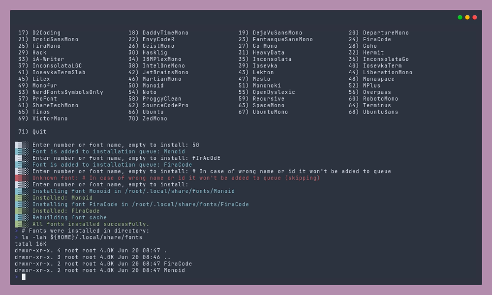

<h1 style="text-align: center;">Nerd Fonts Installer</h1>

<div style="display:flex;justify-content:center">

  
  
  
   
  

</div>

---

The Nerd Fonts installer provides cross-platform scripts to easily install Nerd Fonts from the command line. It includes a bash script for Linux and macOS systems, and a PowerShell script for Windows systems.


[Watch installer demo](./media/videos/install-nerd-font.mp4)


</details>

## Features

### ✨ Cross-Platform Support
- **Linux/macOS**: Bash script (`install.sh`) with user-level font installation
- **Windows (Cygwin/WSL)**: Bash script installs to both `%LOCALAPPDATA%\Microsoft\Windows\Fonts` and `~/.local/share/fonts/`

### 🎯 Easy to Use
- Interactive menu with all 70 Nerd Fonts
- Non-interactive mode for scripting and automation
- Install multiple fonts in one run
- Colored output for better user experience
- Input validation and error handling
- Automatic cleanup of temporary files

### 🔧 Platform-Specific Installation
- **Linux**: Installs to `~/.local/share/fonts/` (or `$XDG_DATA_HOME/fonts/`) and refreshes font cache
- **macOS**: Installs to `~/Library/Fonts/`
- **Windows (Cygwin)**: Installs to both `%LOCALAPPDATA%\Microsoft\Windows\Fonts` and `~/.local/share/fonts/` (or `$XDG_DATA_HOME/fonts/`), and refreshes font cache
- **Windows**: Installs to `%LOCALAPPDATA%\Microsoft\Windows\Fonts` and registers with system

### 📦 Font Support
- Supports both `.ttf` and `.otf` font files
- Downloads latest versions from GitHub releases
- Prefers `.tar.xz` archives (smaller); falls back to `.zip` when `xz` is unavailable
- Handles font extraction and installation automatically

## Compatibility

### Windows Support
- **Windows 10**: Version 1903 (May 2019 Update) or later
- **Windows 11**: All versions supported
- **PowerShell**: 5.1+ or PowerShell Core 6+

The Windows PowerShell script has been tested on:
- Windows 10 Pro for Workstations (Build 26100)
- PowerShell Core 7.5.2
- PowerShell 5.1 (Windows PowerShell)

### Linux/macOS/Cygwin Support
- All modern Linux distributions with Bash 3.2+
- macOS 10.9+ (Mavericks) or later
- Cygwin on Windows 10/11 (requires `curl` or `wget`, `tar` or `unzip`, `cygpath`)

### Linux, macOS and Cygwin (Bash)

**Interactive mode** — pick fonts from a menu:

```bash
bash -c "$(curl -fsSL https://raw.githubusercontent.com/officialrajdeepsingh/nerd-fonts-installer/main/install.sh)"
```

**Non-interactive mode** — install one or more fonts directly:

```bash
# Single font
curl -fsSL https://raw.githubusercontent.com/officialrajdeepsingh/nerd-fonts-installer/main/install.sh | bash -s -- Monoid

# Multiple fonts (space-separated or comma-separated)
curl -fsSL https://raw.githubusercontent.com/officialrajdeepsingh/nerd-fonts-installer/main/install.sh | bash -s -- Monoid Hack JetBrainsMono
curl -fsSL https://raw.githubusercontent.com/officialrajdeepsingh/nerd-fonts-installer/main/install.sh | bash -s -- Monoid,Hack,JetBrainsMono
```

**Options:**

| Flag | Env var | Description |
|---|---|---|
| `--help` / `-h` | — | Show help message with all commands and examples |
| `--list` / `-l` | — | Print all available font names, one per line |
| `--quiet` / `-q` | `LOG_LEVEL=0` | Suppress informational output |
| `--color` | `USE_COLOR=1` | Force colored output |
| `--no-color` | `USE_COLOR=0` | Disable colored output |
| `--nerd-fonts-version=v3.4.0` | `NERD_FONTS_VERSION=v3.4.0` | Pin a specific release (default: latest) |

```bash
# List all available fonts
./install.sh --list

# View help
./install.sh --help

# Pin a specific Nerd Fonts release in non-interactive mode
NERD_FONTS_VERSION=v3.4.0 ./install.sh Monoid
./install.sh --nerd-fonts-version=v3.4.0 Monoid

# Pin a specific release in interactive mode
NERD_FONTS_VERSION=v3.4.0 ./install.sh
./install.sh --nerd-fonts-version=v3.4.0

# Silent install
./install.sh --quiet Monoid
```

### Update installed fonts (Bash)

Re-download and reinstall all currently installed Nerd Fonts to the latest release:

```bash
# Update all installed fonts (auto-detected from font directory)
./install.sh update
```

> **Note:** Auto-detect scans `${FONT_DIR}/<FontName>/` subdirectories. On macOS this feature won't work.

`update` respects `NERD_FONTS_VERSION` to pin a specific release:
```bash
NERD_FONTS_VERSION=v3.4.0 ./install.sh update
```

### Windows (Cygwin/WSL)
On Windows, run the bash script via **Cygwin** or **WSL**. The script auto-detects Cygwin and installs fonts to both `%LOCALAPPDATA%\Microsoft\Windows\Fonts` and `~/.local/share/fonts/`.

```bash
bash <(curl -fsSL 'https://raw.githubusercontent.com/officialrajdeepsingh/nerd-fonts-installer/main/install.sh')
```
